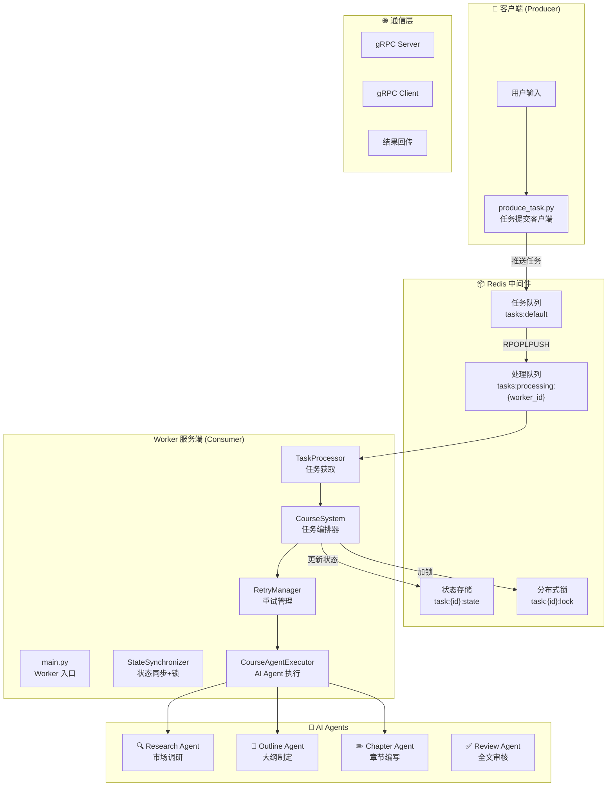
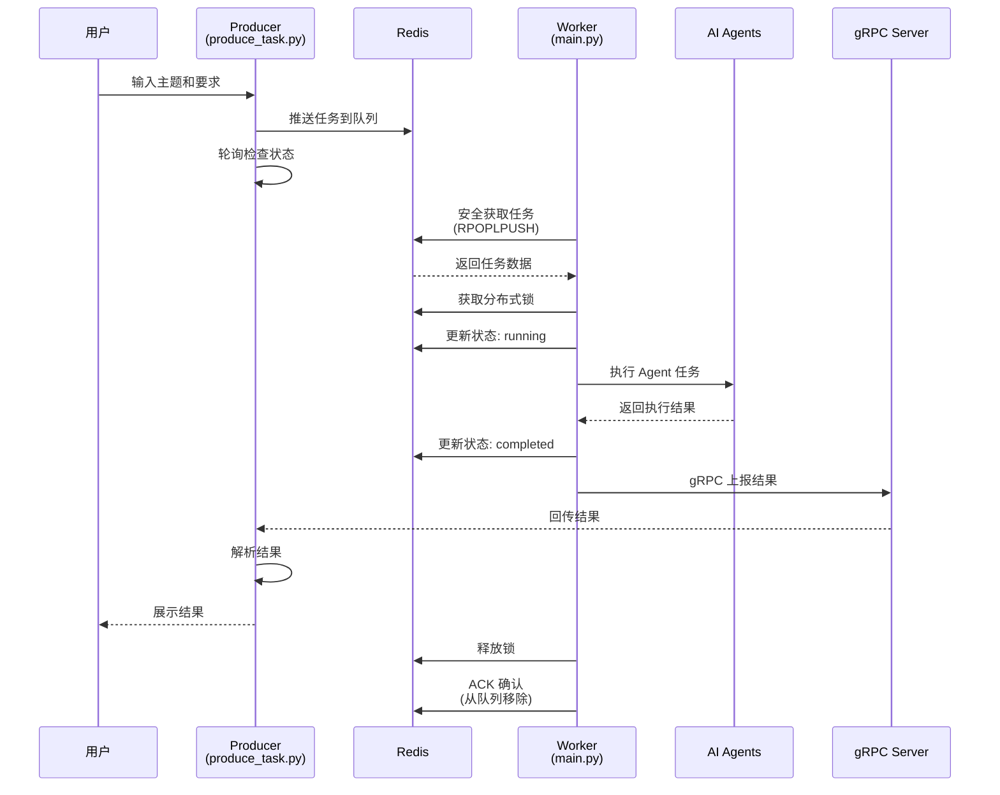
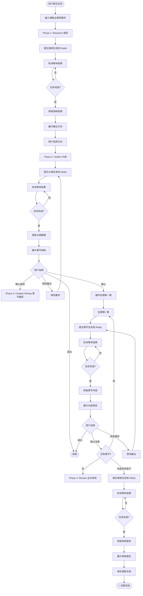
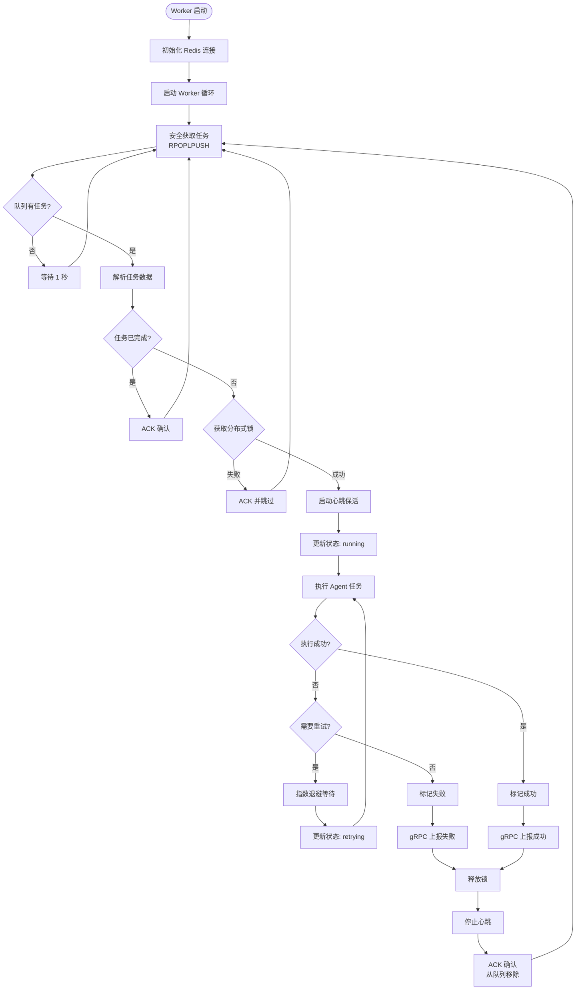
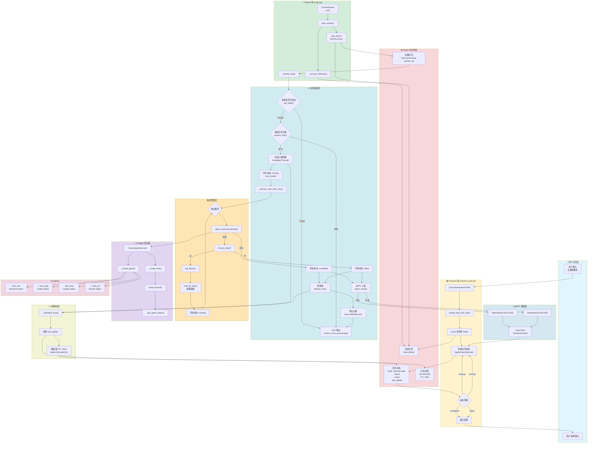

# CourseFlow - 分布式 AI 课程生成系统

基于 gRPC + Redis 的多 Agent 协作平台，支持任务队列持久化、状态同步和失败重试机制

## 🎯 项目简介

CourseFlow 是一个分布式 AI 课程生成系统，通过多个 AI Agent 协作完成课程的调研、大纲制定、章节编写和全文审核。系统采用微服务架构，使用 Redis 作为任务队列和状态存储，gRPC 实现服务间通信，确保高可靠性和可扩展性。

## ✨ 核心特性

- 🔥 多 Agent 协作：研究、写作、审核、润色等多个专业 Agent 协同工作
- 📦 Redis 任务队列：任务持久化存储，支持高并发
- 🔒 分布式锁：防止任务重复执行，确保数据一致性
- 🔄 失败重试机制：指数退避算法，自动重试失败任务
- 💓 心跳保活：防止 Worker 宕机导致任务锁死
- 🌐 gRPC 通信：高效的跨服务通信和状态同步
- 📊 实时状态追踪：任务状态实时更新，支持监控和查询

##  🚀 快速开始

环境要求

- Python >= 3.11
- Redis Server
- gRPC 支持

安装依赖

`pip install -r requirements.txt`

配置环境变量

```
cp .env.example .env
# 编辑 .env 文件，填入你的 API Key
```

.env 示例：

```yml
# AI API Key
DASHSCOPE_API_KEY=your-dashscope-api-key

# 可选：搜索 API
SERPER_API_KEY=your-serper-api-key

# Redis 配置（默认即可）
REDIS_HOST=localhost
REDIS_PORT=6379
```

启动服务

1️⃣ 启动 Worker（服务端）

```
python main.py
```

2️⃣ 提交任务（客户端）

```
python produce_task.py
```

交互式输入课程主题和要求，系统将自动完成课程生成。

执行示例：

```
==================================================
AI Course Generation Client (Interactive)
AI 课程生成客户端 (交互式)
==================================================

请输入课程主题 (Topic): Python 异步编程
请输入课程要求 (Requirements): 适合初学者

------------------------------
Phase 1: Research (市场调研)
------------------------------
[Task] Submitting 'research' task...
[Wait] Waiting for result... Done! (3.2s)

 建议的课程方向:
1. asyncio 基础概念
2. 实际应用场景
...

请输入您选择的方向: asyncio 基础概念

------------------------------
Phase 2: Outline (大纲制定)
------------------------------
...

🎉 课程生成流程全部完成！

```


### ⚙️ 配置说明

```python
# Redis 配置
# utils/redis_client.py
REDIS_HOST = os.getenv('REDIS_HOST', 'localhost')
REDIS_PORT = int(os.getenv('REDIS_PORT', 6379))

# 重试策略
# extend/retry_manager.py
max_retries = 3  # 最大重试次数
backoff_factor = 2  # 退避因子（指数增长）

# gRC配置
# extend/grpc_client.py
GRPC_TARGET = os.getenv('GRPC_TARGET', 'localhost:50051')
```


## 📁 项目结构


```
project5_2/
├── main.py                  # Worker 入口
├── produce_task.py          # Producer 客户端
├── requirements.txt         # Python 依赖
├── .env.example            # 环境变量示例
├── src/
│   ├── course_system.py    # 核心系统逻辑,负责任务编排 (获取 -> 加锁 -> 执行 -> 上报)。
│   ├── protos/             # gRPC proto 文件
│   │   ├── task.proto
│   │   ├── task_pb2.py
│   │   └── task_pb2_grpc.py
│   └── utils/
│       └── redis_client.py # Redis 客户端
├── extend/					# 封装了 Redis、gRPC、重试等通用分布式能力。
│   ├── task_processor.py   # 任务处理器
│   ├── agent_executor.py   # Agent 执行器
│   ├── grpc_client.py      # gRPC 客户端
│   ├── retry_manager.py    # 重试管理器
│   ── state_synchronizer.py # 状态同步器
└── config/                 # 配置文件

```


## 🏗️ 系统架构




## 📋 工作流程

任务阶段

1. 🔍 Research（市场调研）
   1. 搜索相关主题信息
   2. 提供建议的课程方向
   3. 用户选择方向
2. 📝 Outline（大纲制定）
   1. 生成课程章节结构
   2. 用户确认或修改
3. Chapter Writing（章节编写）
   1. 逐章编写详细内容
   2. 支持修改重写
4. ✅ Review（全文审核）
   1. 质量检查和优化建议
   2. 生成最终课程文档

执行示例：

```
==================================================
AI Course Generation Client (Interactive)
AI 课程生成客户端 (交互式)
==================================================

请输入课程主题 (Topic): Python 异步编程
请输入课程要求 (Requirements): 适合初学者

------------------------------
Phase 1: Research (市场调研)
------------------------------
[Task] Submitting 'research' task...
[Wait] Waiting for result... Done! (3.2s)

 建议的课程方向:
1. asyncio 基础概念
2. 实际应用场景
...

请输入您选择的方向: asyncio 基础概念

------------------------------
Phase 2: Outline (大纲制定)
------------------------------
...

🎉 课程生成流程全部完成！

```

## 🔄 数据流向

```
用户 → Producer → Redis 队列 → Worker → Agents → gRPC → Producer → 用户
```




## 🔄 运行流程图



Worker 端处理流程




## 🛠️ 技术栈

### 核心技术

- **Redis**: 任务队列、状态存储、分布式锁
- **gRPC**: 服务间通信、结果回传
- **Python**: 主要开发语言
- **Protocol Buffers**: gRPC 数据序列化

### AI 框架

- **DashScope**: 阿里云通义千问 API
- **LangChain**: Agent 编排框架
- **FastMCP**: MCP 协议支持

### 关键组件

| 组件                | 文件                           | 功能               |
| ------------------- | ------------------------------ | ------------------ |
| TaskProcessor       | `extend/task_processor.py`     | 任务队列管理       |
| StateSynchronizer   | `extend/state_synchronizer.py` | 分布式锁和状态同步 |
| RetryManager        | `extend/retry_manager.py`      | 失败重试策略       |
| GrpcClient          | `extend/grpc_client.py`        | gRPC 客户端        |
| CourseAgentExecutor | `extend/agent_executor.py`     | AI Agent 执行器    |
| RedisManager        | `utils/redis_client.py`        | Redis 连接管理     |

### 技术难点

✅ **任务不丢失**
- Redis 持久化存储：Worker 宕机后任务仍在 processing_queue
- 安全获取（RPOPLPUSH）：任务从源队列移动到处理队列是原子的
- 遗留任务恢复机制：启动时自动检查并重新处理

✅ **避免重复执行**
- 分布式锁（基于 Redis）：SET NX 确保同一时刻只有一个 Worker 持有锁
- 幂等性检查：执行前检查 task:{id}:state.status == 'completed' 
- 任务状态追踪：锁超时机制：TTL=300s 防止死锁

✅ **跨服务状态同步**
- Redis Hash 存储状态：所有 Worker 共享 task:{id}:state
- gRPC 实时上报：running → completed/failed/retrying 状态变更立即写入
- 心跳保活机制：客户端轮询：submit_task_and_wait 每秒检查状态

✅ **失败重试**
- 指数退避算法：delay = base_delay * 2^retries + jitter
- 可配置重试次数：默认 3 次
- 详细日志记录：每次重试更新 retry_count 到 Redis

---


健壮的分布式处理流程：
1.*幂等性检查* *(Idempotency):* *检查任务是否已完成，避免重复消费。
2.* *分布式锁* *(Distributed Lock):* *确保同一时刻只有一个* *Worker* *处理该任务。
3.* *状态同步* *(State Sync):* *将任务状态* *(running/completed/failed)* *实时同步到* *Redis，供前端或监控查询。
4.* *结果上报* *(Result Reporting):* *通过* *gRPC* *将结果回传给主服务。
5.* *消息确认* *(ACK):* *处理完成后从* *Redis* *队列移除消息。*




